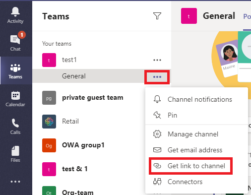
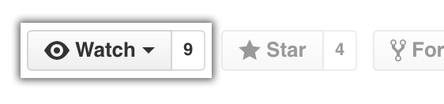

# GitHub Onboarding
&nbsp;
[](#Contact)&nbsp;

⚠️&nbsp; Please read this entire document carefully.

## Content
* [Rules](#rules)
* [GitHub User Account Setup](#github-user-account-setup)
* [Repository Setup](#repository-setup)
  * [Naming Convention](#naming-convention-for-personal-repositories)
  * [Visibility](#visibility)
  * [README File Conventions](#readme-file-conventions)
* [GitHub Actions](#github-actions)
  * [OpenID Connect](#openid-connect)

## Rules
- [Repository Naming Conventions](#repository-naming-convention)
- [Readme File Conventions](#readme-file-conventions)


## GitHub User Account Setup
* https://github.com/settings/emails#email
  * Add and verify your `...@FOO.net` email address
* https://github.com/settings/notifications#organization_routing
  * Ensure your organization notifications are send to your `...@FOO.net`  email address
* https://github.com/settings/keys
  * Add your machine SSH key
  * `Configure SSO` for your SSH key and `Authorize` FOO


## Repository Setup

#### Repository Naming Convention
- `<PRODUCT/SERVICE/DOMAIN>[-MODULE]`
  - e.g. `juice-shop` or with module names `juice-shop-docs`, `juice-shop-frontend`, `juice-shop-api`, `juice-shop-infrastructure`, ...
- Repository name **should not** contain team name
  - Except the team name is the same as the product/service/domain
  - Except it is a product/service/domain unrelated repository e.g. team specific code or tooling
    - In that case you **should** use you team name as a [namespace](#team-and-personal-namespaces)
##### Team and Personal Namespaces    
- `<TEAM/GITHUB_USER_NAME>--<REPOSITORY_NAME>`
  - e.g. `team-red-herring--wiki` or `john.doe--sandbox`

#### Visibility
  * `public`&nbsp; Only available for organization owners. If you want to publish an OSS repository [get in touch with us](#contact).
  * `internal`&nbsp; **<sub><sup>[DEFAULT]</sup></sub>** Members of any organization belonging to [FOO](https://github.com/enterprises/) can see a repository.
  * `private`&nbsp; Only members with direct access can acces a repository.
* [Configuring autolinks to reference external resources](https://docs.github.com/en/repositories/managing-your-repositorys-settings-and-features/managing-repository-settings/configuring-autolinks-to-reference-external-resources)
* GitHub Pages
  * Visibility
    * `public`&nbsp; Anyone can see pages
    * `private`&nbsp; Only members with access to the repository can see pages

#### README File Conventions
* [README Template](README.template.md)

##### Information Classification Level
Add one of the following information classification level badges below the README headline, see [README Template](README.template.md)

*  
  * The information may be available to everyone at all times
  * e.g. public contents on websites, press information
* 
  * The information must only be accessible internally
  * e.g. intranet contents, internal team records
*  
  * The information must only be accessible to others after the owner has released the information
  * e.g. management reports, security architectures of critical systems
*  
  * The information must only be accessible to others upon release by the management
  * e.g. intended corporate purchases, strategy papers
  <br>
 
* <details>
    <summary>Markdown Badge Snippets</summary>

    * 
 
      `&nbsp;`
 
    * 
 
      `&nbsp;`
 
    * 
 
      `&nbsp;`
 
    * 
 
      `&nbsp;`
</details>
    
    
##### Contact Informations    
Add team contact informations to README footer, see [README Template](README.template.md#Contact)
* MS Teams Support Channel
* Support E-mail Address
  <br><br>

* <details>
    <summary>Markdown Badge Snippets</summary>

    * [](#Contact)&nbsp;
 
      ```markdown
      [](#Contact)&nbsp;
      ```
    * <a href="https://teams.microsoft.com/l/channel/...">
         MS Teams
      </a>
      <br><br>
 
      ```html
      <a href="https://teams.microsoft.com/l/channel/...">
         Support Channel
      </a>
      ```
    * <a href="mailto:team.rainbow@example.net">
         E-mail
      </a>
      <br><br>
 
      ```html
      <a href="mailto:team.rainbow@example.net">
         team.rainbow@example.net
      </a>
      ```
    * <a href="https://FOO.atlassian.net/jira/software/c/projects/...">
         Jira
      </a>
      <br><br>
 
      ```html
      <a href="https://FOO.atlassian.net/jira/software/c/projects/...">
         Issue Tracker
      </a>
      ```
  </details>
* <details>
    <summary>Get MS Teams Channel Link</summary>

    
  </details>


## GitHub Actions

### OpenID Connect
* [Enabling OpenID Connect for your cloud provider](https://docs.github.com/en/actions/deployment/security-hardening-your-deployments/about-security-hardening-with-openid-connect#enabling-openid-connect-for-your-cloud-provider)
* **WIP** https://docs.github.com/en/actions/deployment/security-hardening-your-deployments/about-security-hardening-with-openid-connect#example-subject-claims
* **WIP** https://www.eliasbrange.dev/posts/secure-aws-deploys-from-github-actions-with-oidc/

---
## Confirm Your Onboarding
⚠️&nbsp;  Please confirm your onboarding by [**Watch**](#repository-container-header) `All Activity` on this project.

[](#repository-container-header)

---
## Contact
* John Doe 
  * <a href="https://teams.microsoft.com/l/chat/0/0?users=JOHN.DOE@EXAMPLE.NET">
       John Doe
    </a>
  * <a href="JOHN.DOE@EXAMPLE.NET">
       john.doe@example.net
    </a> 
